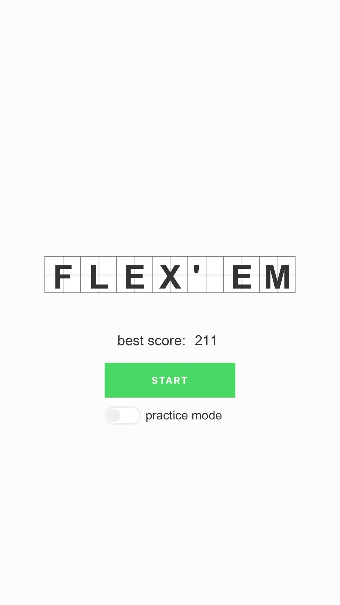
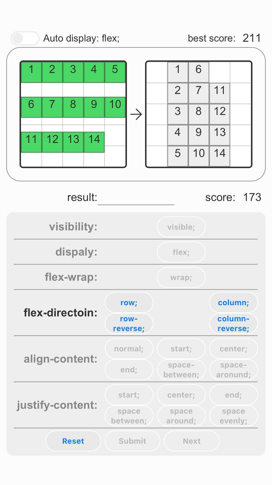

# FLEX'EM
> A simple web game to practice Flexbox of css

cssのレイアウト方法「フレックスボックス」を適用した要素の様々な挙動を、視覚的に体験できるwebゲームです。 
レスポンシブ対応でスマートフォンでも操作でき、PWAにも対応しています。

- [URL](#URL)
- [目的](#目的)
- [使用技術](#使用技術)
- [使い方](#使い方)
- [感想](#感想)

## URL
https://yuki-kaze.net/apli/nakatsu/flexem/

## 目的
CSSを学習する中で、フレックスボックス周りの指定の種類が多く混同してしまっていたため、はっきりと理解できるようそれぞれの挙動を一目で確認できるものを制作してみようと思いました。また、折角なら楽しみながら反復できるよう「連続正解でハイスコアを目指すゲーム」をコンセプトとしてゲーム性を持たせました。

## 使用技術
- HTML
- CSS
- JavaScript

## 使い方
- 「START」ボタンを押した後、実際のプレイ画面に映ります。
- 提示されたサンプルに倣って、要素の集合をフレックスボックスを活用しながら変形させていき、サンプルと同じ形にできれば正解です。
- 「Auto display: flex;」を有効化することで繰り返しが必要な指定を短縮できるようになります。
- 「practice mode」を有効化することで、スコアがカウントされなくなり、スタイルの指定を何度でも出来るようになります。

## 感想
初めて自らの力のみでwebアプリを制作するということで、分からない事ばかりで悪戦苦闘しましたが、簡素ながらも完成させた時の達成感は大きく、より良いものを作りたいという次への活力に繋がりました。
テストプレイやアプリの制作作業そのものを通して、私自身はフレックスボックスの挙動についてより理解を深めることができたため、このアプリの制作目的は達成されたとも言えますが、制作の過程で見つかった新たな課題点や反省もいくつかありました。中でも後付けで追加した機能がいくつかあったため、コードが煩雑で読みづらいものとなってしまったのが一番の心残りです。今後は拡張性に優れた書き方をできるよう学習を続けていく所存です。
